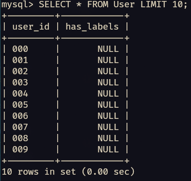
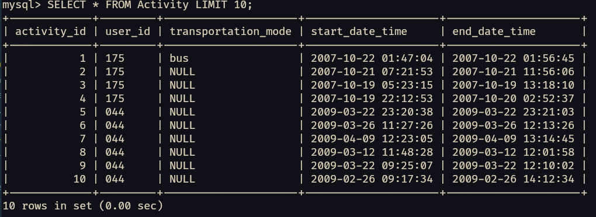
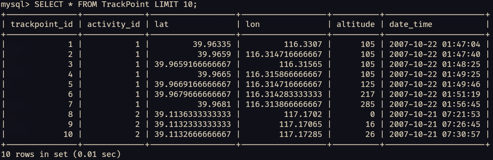
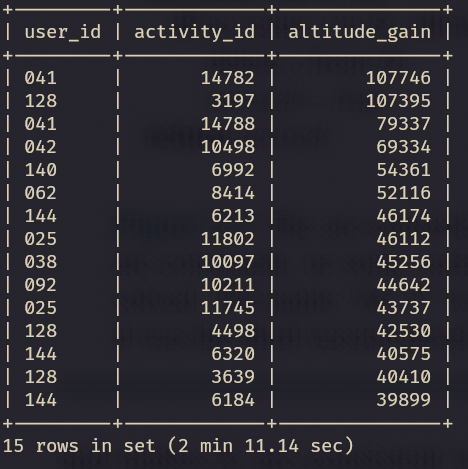

# Report

Group: 30
Students: Name Namesen, Dude Dudesen, ...

# Introduction
[Git repository](https://github.com/Lawrence-Pet/tdt4225_A2) 

Briefly explain the task and the problems you have solved. How did you work as a group? If you used Git, a link to the repository would be nice.

We have 

# Results
Add your results from the tasks, both as text and screenshots. Short sentences are sufficient.

## Part 1

## Part 2

## Part 3

# Discussion
Discuss your solutions. Did you do anything differently than how it was explained in the assignment sheet, in that case why and how did that work? Were there any pain points or problems? What did you learn from this assignment?

# Feedback
Optional - give us feedback on the task if you have any. The assignment is new this semester and we would love to improve if there were any problems.

