# Report

Group: 30
Students: Fredrik Andresen, Peter Lawrence

# Introduction
[Git repository](https://github.com/Lawrence-Pet/tdt4225_A2) 

Briefly explain the task and the problems you have solved. How did you work as a group? If you used Git, a link to the repository would be nice.
Our task for this assigment was to clean the Geolife dataset and insert into a database we created. We were then supposed to perform a series of SQL queries on the data.
We cleaned and inserted the data by using Python. The data was first extracted from the dataset and made into pandas dataframes in DataInsert.py. The dataframes were then cleaned and inserted into the database with DataInsert.py and SqlQueries.py. 
The SQL queries were performed in the database with the help of the SQL queries in SqlQueriespt2.py. 
We worked well together as a group. We used Git to share code and to keep track of changes and worked together both in person and through Discord.

# Results
Add your results from the tasks, both as text and screenshots. Short sentences are sufficient.
## Part 1

## Part 2
### Question 1
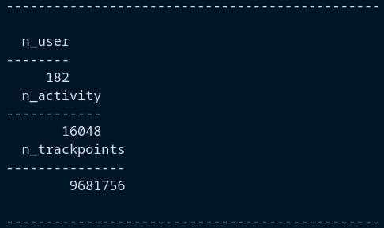)
There are 182 users, 16048 activities and 9681756 trackpoints in the dataset. 
## Question 2
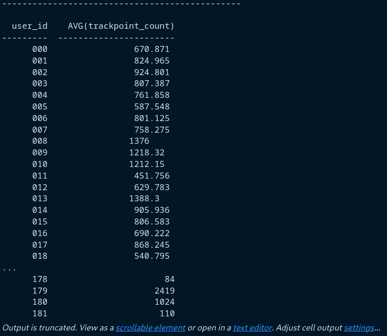 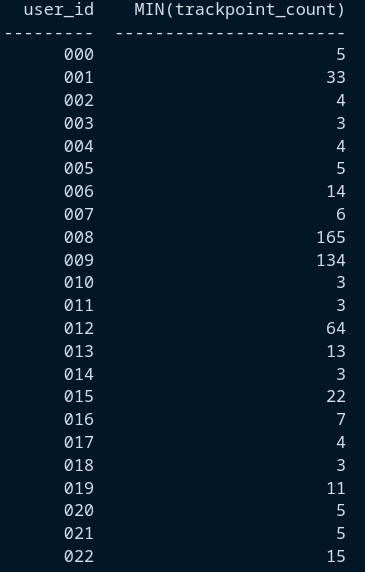 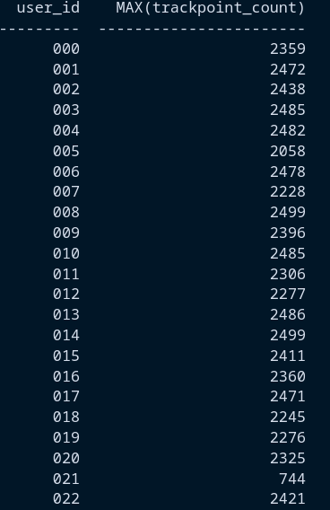
Truncated tables of the average, minimum and maximum number of trackpoints per user is seen above.
## Question 3
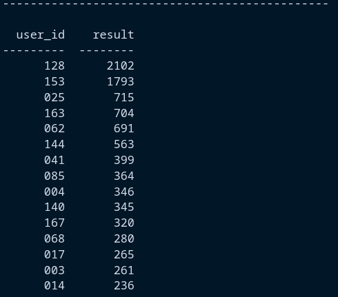
The top 15 users with the highest number of activities are seen in the table above.
## Question 4
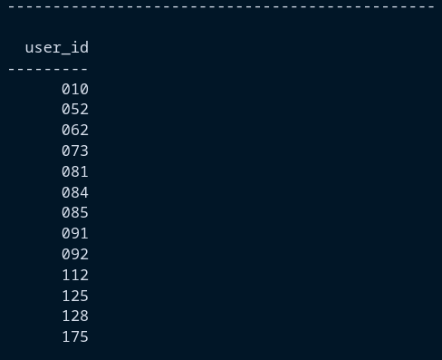
All the users who have taken a bus are in the table above.
## Question 5
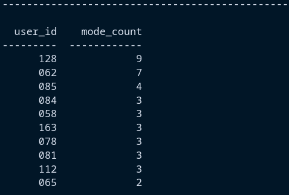
The top 10 users with the highest amount of different transportation modes used seen in the table above.
## Question 6
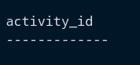
There are no activities that are registered multiple times. 
## Question 7
### a
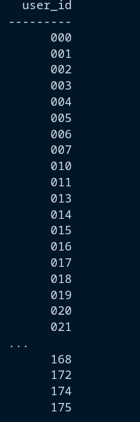
The number of users who have started an activity in one day and finished it in another day can be seen in the table above.
### b

The list of transportation mode, user id and duration for those activities are in the table above.
## Question 8

The number of users who have been close to each other in space and time are x.
## Question 9
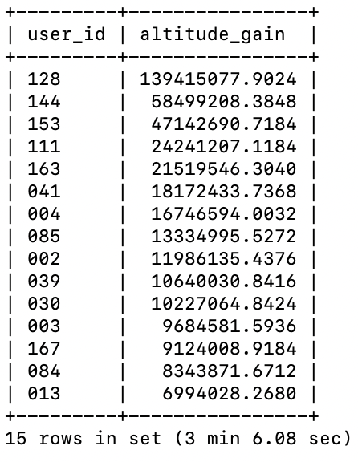
The top 15 users who have gained the most altitude are in the table above.
## Question 10
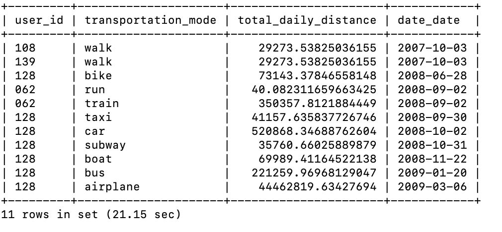
The users who have traveled the longest total distance in one day for each transportation mode are in the table above.
## Question 11
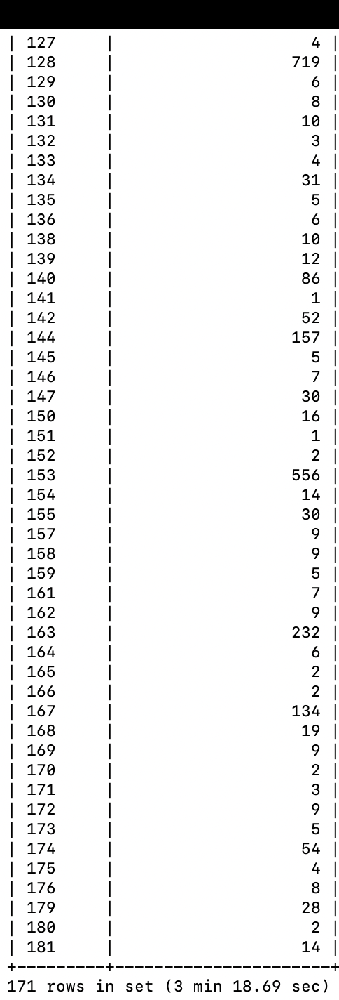 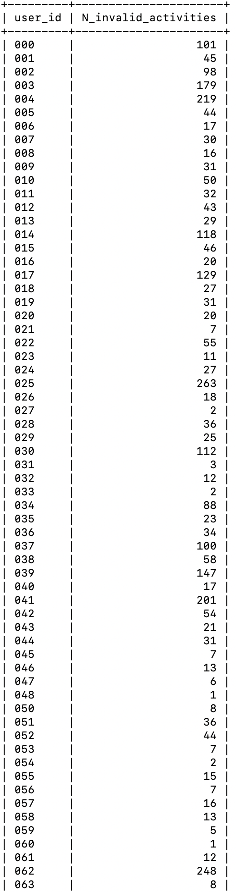 
The users who have invalid activities and the number of invalid activities they have are in the tables above.
## Question 12
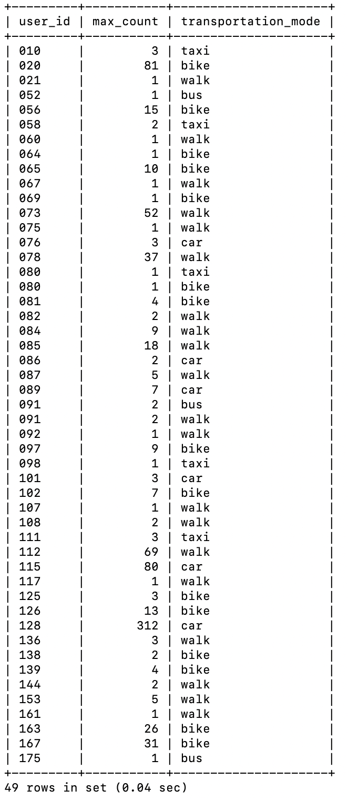
The users who have registered transportation modes and their most used transportation mode are in the table above.

# Discussion
Discuss your solutions. Did you do anything differently than how it was explained in the assignment sheet, in that case why and how did that work? Were there any pain points or problems? What did you learn from this assignment?

We did not do anything differently than how it was explained in the assignment sheet. 

For the question queries, we ended up doing all with pure SQL. It would perhaps have been easier to do some of them with Python, as we are more familiar with that. However, we decided to try to do them all with SQL only. Some pain points were that some of the queries became fairly long and complicated. This made them hard to read and debug when they didn't work. Some of them also took a long time to run, which severly slowed down the process of debugging.

For question 10 we ended up with two users who had the same total distance for the same transportation mode. We decided to include both users in the answer, although we suspect they are duplicates in the database.

Part2.ipynb has some details about the more complicated queries. 
# Feedback
The query for question 8 took an excessive amount of time to figure out and to execute (More than 1,5 hours to execute). It would have been helpful if one of the hints gave an idea of how to solve the problem efficiently.