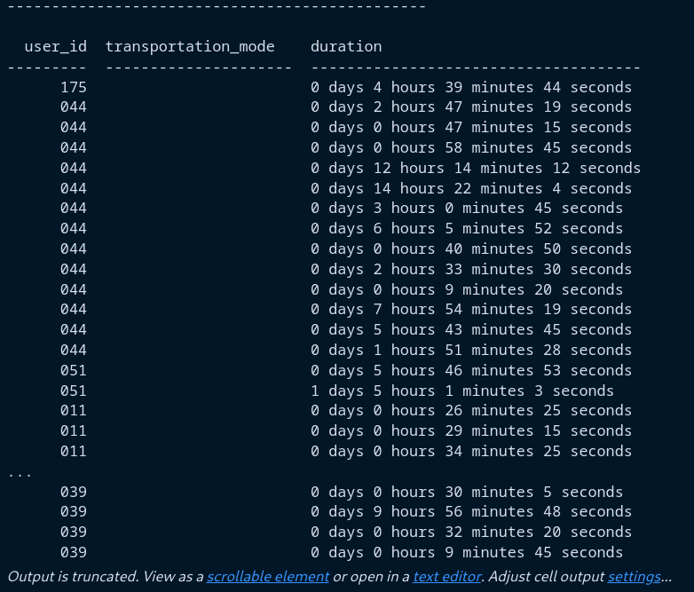

# Report

Group: 30

Students: Fredrik Andresen, Peter Lawrence

# Introduction
[Git repository](https://github.com/Lawrence-Pet/tdt4225_A2) 
**Briefly explain the task and the problems you have solved. How did you work as a group? If you used Git, a link to the repository would be nice.**


Our task for this assigment was to clean the Geolife dataset and insert into a database we created. We were then supposed to perform a series of SQL queries on the data.
We cleaned and inserted the data by using Python. The data was first extracted from the dataset and made into pandas dataframes in DataInsert.py. The dataframes were then cleaned and inserted into the database with DataInsert.py and SqlQueries.py. 

The SQL queries were performed in the database with the help of the SQL queries in SqlQueriespt2.py. 
We worked well together as a group. We used Git to share code and to keep track of changes and worked together both in person and through Discord.

# Results
All tables who were too long to screenshot have been truncated.
## Part 1


## Part 2
### Question 1


There are 182 users, 16048 activities and 9681756 trackpoints in the dataset. 
## Question 2
  

Truncated tables of the average, minimum and maximum number of trackpoints per user is seen above.
## Question 3


The top 15 users with the highest number of activities are seen in the table above.
## Question 4


All the users who have taken a bus are in the table above.
## Question 5


The top 10 users with the highest amount of different transportation modes used seen in the table above.
## Question 6


There are no activities that are registered multiple times. 
## Question 7
### a)


The number of users who have started an activity in one day and finished it in another day can be seen in the table above.

### b)


The list of transportation mode, user id and duration for those activities are in the table above.

## Question 8
For this task we tried numerous queries, we've ended up with some queries that we believe have potential but none of them has completed their queries as of now. However we have some suggestions to how such a query can look like: 

```sql
WITH close_time (user_id1, user_id2, activity_id1, activity_id2) AS (
    SELECT DISTINCT A1.user_id AS user1, A2.user_id AS user2, A1.activity_id AS activity_id1, A2.activity_id AS activity_id2
    FROM Activity AS A1
    INNER JOIN Activity AS A2 ON A1.user_id <> A2.user_id
        AND (ABS(TIMESTAMPDIFF(SECOND, A1.start_date_time, A2.end_date_time)) <= 30
            OR ABS(TIMESTAMPDIFF(SECOND, A1.end_date_time, A2.start_date_time)) <= 30
            OR A1.start_date_time BETWEEN A2.start_date_time AND A2.end_date_time
            OR A1.end_date_time BETWEEN A2.start_date_time AND A2.end_date_time)
        AND A1.user_id < A2.user_id
        AND A1.user_id < 050
),
trackpoints (tr_activity_id, lat, lon, tr_date_time) AS (
    SELECT activity_id, lat, lon, date_time
    FROM TrackPoint
)
SELECT COUNT(DISTINCT user_id1) AS number_of_users
    FROM close_time
INNER JOIN trackpoints AS T1 ON activity_id1 = T1.tr_activity_id
INNER JOIN trackpoints AS T2 ON activity_id2 = T2.tr_activity_id
AND ST_Distance_Sphere(
        POINT(T1.lon, T1.lat),
        POINT(T2.lon, T2.lat)
        ) <= 50
```

Other possible queries can be found in the folder ```src/PART2_individual_SQL```


## Question 9


The top 15 users who have gained the most altitude are in the table above.
## Question 10


The users who have traveled the longest total distance in one day for each transportation mode are in the table above.
## Question 11

  


The users who have invalid activities and the number of invalid activities they have are in the tables above.
## Question 12


The users who have registered transportation modes and their most used transportation mode are in the table above.


# Discussion

**Discuss your solutions. Did you do anything differently than how it was explained in the assignment sheet, in that case why and how did that work? Were there any pain points or problems? What did you learn from this assignment?**

We did not do anything differently than how it was explained in the assignment sheet. 

For the question queries, we ended up doing all of them with pure SQL. It would perhaps have been easier to do some of them with Python, as we are more familiar with that. However, we decided to try to do them all with SQL only. Some pain points were that some of the queries became fairly long and complicated. This made them hard to read and debug when they didn't work. Some of them also took a long time to run, which severly slowed down the process of debugging.

The time complexity for question 8 was too high and we were unable to get a screenshot of the output of the query.
For question 10 we ended up with two users who had the same total distance for the same transportation mode. We decided to include both users in the answer, although we suspect they are duplicates in the database.

>The jupyter notebook Part2.ipynb has some details about the more complicated queries. Also the notebook provides (with the other .py delivered) functions for calling all queries, except Q8. Results from these calls are also in this notebook.

# Feedback
The query for question 8 took an excessive amount of time to figure out and to execute (More than 2 hours to execute). It would have been helpful if one of the hints gave an idea of how to solve the problem efficiently.
